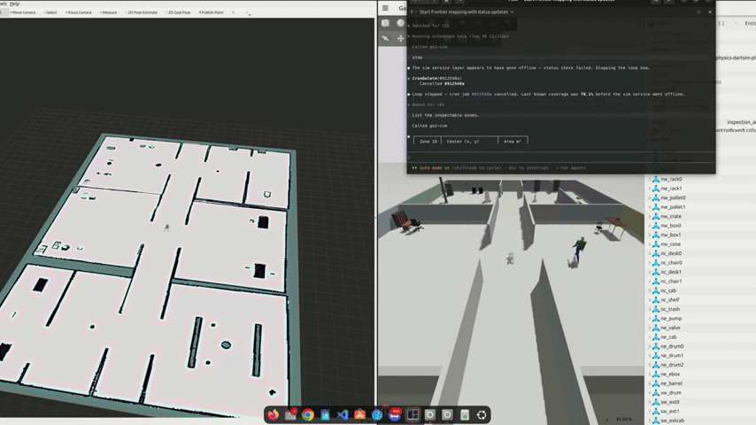
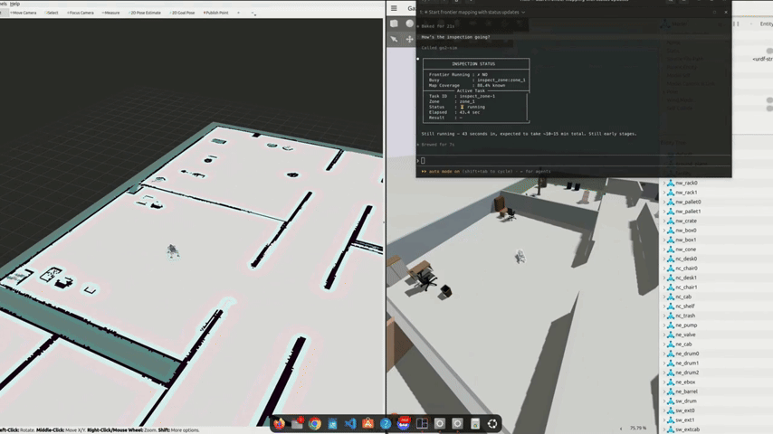
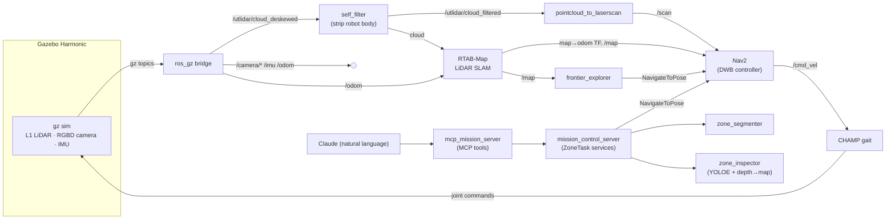
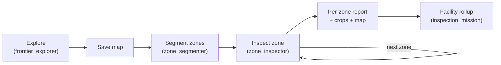
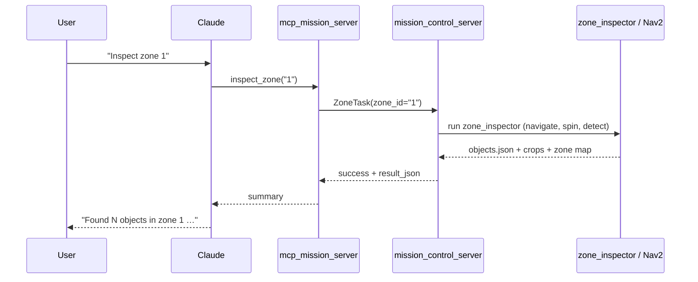

# Go2 Inspection

**A simulation-first ROS 2 stack for autonomous facility inspection with a Unitree Go2 quadruped — drivable end-to-end from natural language.**

The robot maps an unknown area on its own, splits it into rooms ("zones"), then walks each zone and reports what it sees using an open-vocabulary camera detector. Every step can be triggered by plain-English commands through an [MCP](https://modelcontextprotocol.io) server bridged to Claude — *"explore the area"*, *"what zones did you find?"*, *"inspect zone 1"*, *"give me the report."*

> Built on ROS 2 **Jazzy** + Gazebo **Harmonic**, with [CHAMP](https://github.com/chvmp/champ) for the walking gait, RTAB‑Map for LiDAR SLAM, and Nav2 for navigation.

---

## Demo

All four steps below are issued as **natural-language commands** to Claude; the MCP server translates them into ROS service calls. The clips below show each step running in the simulator.

### 1. Frontier exploration
> 🗣️ *"Start exploring and map the area."* → `start_exploration`

The robot autonomously drives to map frontiers (free space bordering the unknown), building the occupancy map as it walks. No waypoints given — it picks the most informative places to go.


### 2. List the scanned zones
> 🗣️ *"What zones did you find?"* → `list_zones` (+ `get_zone_image`)

Once mapping is done and the map is segmented, the robot reports the discovered zones. The clip ends on the segmentation overlay — each room becomes a distinct, navigable zone:



### 3. Inspect a zone
> 🗣️ *"Inspect zone 1."* → `inspect_zone("1")`

The robot navigates into the zone, performs a 360° spin while running the camera detector, localizes each detection on the map (via depth → map projection), de-duplicates repeated objects, and saves cropped images.


### 4. Zone details & report
> 🗣️ *"Tell me about zone 1 and give me the report."* → `get_zone_objects` / `get_report`

The robot returns the structured findings — objects, counts, confidences, and links to the annotated crops and per-zone map.



---

## Features

- **Autonomous exploration** — information‑gain frontier selection with stuck/blacklist recovery; never drives blind (`go2_exploration`).
- **LiDAR graph‑SLAM** — RTAB‑Map fuses the 4D L1 LiDAR + fused odometry into a `map → odom` transform and a 2D grid; teleport‑proof (no visual loop closure).
- **Robust zone segmentation** — obstacle‑island fill + watershed + door‑aware room separation turns any saved map into labelled zones (`go2_zones`).
- **Open‑vocabulary inspection** — viewpoint sampling + in‑place spin with YOLOE detection, depth→map localization, de‑duplication, and per‑zone / facility reports with crops (`go2_inspection`).
- **Natural‑language control** — a FastMCP server exposes the whole mission as 14 tools callable from Claude.
- **Walking quadruped in sim** — CHAMP gait on Gazebo Harmonic via `gz_ros2_control`, with the real‑Go2 topic contract mirrored so nodes port unchanged to hardware.

---

## Architecture

### Runtime data flow



### Mission pipeline



### A natural-language command, end to end



---

## Packages

Custom packages in this repository (the `champ*` packages are vendored from [CHAMP](https://github.com/chvmp/champ) and keep their upstream authorship/license):

| Package | What it provides |
|---------|------------------|
| [`go2_bringup`](go2_bringup/README.md) | Launch + config hub: sim, SLAM, Nav2, octomap, exploration, and mission orchestration launch files; Nav2 / bridge / scan configs. |
| [`go2_description`](go2_description/README.md) | Go2 URDF/xacro robot model and simulated sensors (L1 LiDAR, RGBD camera, IMU) for Gazebo. |
| [`go2_config`](go2_config/README.md) | CHAMP gait / joints / links maps and `ros_control` configuration for the Go2. |
| [`go2_exploration`](go2_exploration/README.md) | C++ `frontier_explorer` (autonomous mapping) and `self_filter` (remove robot body from the LiDAR cloud). |
| [`go2_zones`](go2_zones/README.md) | `zone_segmenter` — turns a saved occupancy map into labelled, navigable zones. |
| [`go2_inspection`](go2_inspection/README.md) | The mission brain: `zone_inspector` (YOLOE inspection), `inspection_mission`, `mission_control_server` (ROS service layer), and the MCP server. |
| [`go2_inspection_interfaces`](go2_inspection_interfaces/README.md) | `ZoneTask.srv` — the uniform request/response used by every mission‑control service. |
| [`go2_worlds`](go2_worlds/README.md) | Gazebo worlds (maze, facility, inspection arena) and procedural world/map generator scripts. |

---

## Natural-language command reference

The MCP server (`mcp_mission_server`) exposes these tools; the phrases are examples of what you'd say to Claude.

| MCP tool | Say something like | Action |
|----------|--------------------|--------|
| `start_exploration` | "start exploring / map the area" | Begin autonomous frontier exploration. |
| `stop_exploration` | "stop exploring" | Halt exploration. |
| `save_map` | "save the map" | Persist the current map and (re)segment zones. |
| `list_zones` | "what zones did you find?" | List the segmented zones. |
| `navigate_to_zone` | "go to zone 2" | Drive to a zone without inspecting. |
| `navigate_home` | "go back home" | Return to the start pose. |
| `inspect_zone` | "inspect zone 1" | Navigate + 360° scan + detect + report one zone. |
| `run_mission` | "inspect every zone" | Inspect all zones in sequence. |
| `cancel_task` | "cancel" | Cancel the running task. |
| `get_zone_objects` | "what's in zone 1?" | Structured detected objects for a zone. |
| `get_zone_gauges` | "any gauges in zone 1?" | Gauge‑type findings for a zone. |
| `get_report` | "give me the report" | Facility‑wide inspection report. |
| `get_status` | "what are you doing?" | Current mission/task status. |
| `get_zone_image` | "show me zone 1" | Annotated crops / zone map image (inline). |

---

## Quickstart

### Prerequisites
- ROS 2 **Jazzy**, Gazebo **Harmonic** (`ros-jazzy-ros-gz`), Nav2, RTAB‑Map, `pointcloud_to_laserscan`, octomap server.
- Python deps for inspection: `ultralytics` (YOLOE), OpenCV, NumPy.
- For natural‑language control: the [Claude CLI](https://docs.claude.com/en/docs/claude-code) with MCP support, and a Python venv with `fastmcp`.

### Build
```bash
cd go2-sim/go2_ws
colcon build --symlink-install
source /opt/ros/jazzy/setup.bash
source install/setup.bash
```

### Run — mapping / exploration
```bash
# Bring up the sim + SLAM + Nav2 + exploration stack
ros2 launch go2_bringup sim_mapping.launch.py world:=inspection_arena.sdf headless:=false

# (or start the frontier explorer directly)
ros2 run go2_exploration frontier_explorer --ros-args -p use_sim_time:=true -p autostart:=true
```

### Run — inspection (with a saved map)
```bash
ros2 launch go2_bringup inspection_nav.launch.py \
    world:=inspection_arena.sdf map_yaml:=~/.go2_maps/facility_inspection_map.yaml headless:=false

# Mission-control service layer (what the MCP server calls)
ros2 launch go2_bringup mission_control.launch.py \
    zones_file:=~/.go2_maps/facility_inspection_zones.yaml map_name:=facility_inspection
```

### Run — natural language (MCP + Claude)
With the mission‑control stack running, register the MCP server once, then talk to Claude:
```bash
claude mcp add go2-sim -- /absolute/path/to/go2-sim/run_mcp_sim.sh
```
Then: *"start exploring"*, *"what zones did you find?"*, *"inspect zone 1"*, *"give me the report."*

> These commands require ROS 2 Jazzy + Gazebo Harmonic and the local dependencies above; they will not run in CI.

---

## Repository layout

```
go2_ws/src/
├── go2_bringup/                 # launch files + Nav2/bridge/scan configs
├── go2_config/                  # CHAMP gait/joints/links + ros_control
├── go2_description/             # Go2 URDF/xacro + gz sensors
├── go2_exploration/             # frontier_explorer + self_filter (C++)
├── go2_inspection/              # mission brain, zone_inspector, MCP server
├── go2_inspection_interfaces/   # ZoneTask.srv
├── go2_worlds/                  # Gazebo worlds + generator scripts
├── go2_zones/                   # zone_segmenter
├── champ*/                      # vendored CHAMP quadruped controller
├── media/                       # README demo clips + images
└── .clang-format                # C++ style (Google base, 100-col)
```

---