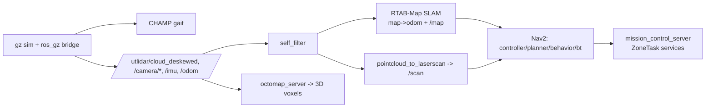

# go2_bringup

Launch and configuration hub for the Go2 inspection simulation stack: it composes Gazebo, the ros_gz bridge, the CHAMP walking gait, RTAB-Map SLAM, Nav2, OctoMap, and the mission service layer into single-command entry points.

## Overview

`go2_bringup` is an `ament_cmake` package that installs only launch files, parameter configs, and RViz layouts (no compiled or Python nodes of its own). It is the package users launch most: every higher-level launcher here pulls together nodes that live in other workspace packages (`go2_description`, `go2_config`, `go2_worlds`, `go2_exploration`, `go2_inspection`, `champ_*`) and upstream ROS packages (`ros_gz_*`, `rtabmap_slam`, `nav2_*`, `octomap_server`, `pointcloud_to_laserscan`). It supports two operating modes: MODE A (fresh mapping / frontier exploration) via `sim_mapping.launch.py`, and MODE B (localization + inspection on a saved map) via `inspection_nav.launch.py` / `mission.launch.py`.



## Launch files

All launchers run with `use_sim_time:=true` and default to headless unless noted. Worlds resolve against `go2_worlds/worlds/`.

### `go2_champ.launch.py`
The base sim layer: starts `gz sim` with the chosen world, `robot_state_publisher`, spawns the Go2 via `ros_gz_sim create`, runs the `ros_gz_bridge` parameter bridge (`config/ros_gz_bridge_champ.yaml`), spawns the `joint_states_controller` and `joint_group_effort_controller`, then (optionally) includes `champ_bringup` so the dog stands and walks from `/cmd_vel`. Nodes are staggered on timers to avoid the spawned-but-uncontrolled "limp legs" collapse.

Key args (defaults): `world` (`lab.sdf`), `headless` (`false`), `champ` (`true`), `spawn_x`/`spawn_y`/`spawn_yaw` (`0.0`), `actor` (`true`, inspection_arena walking human), `fire` (`true`, inspection_arena fire+smoke). Setting `actor:=false` / `fire:=false` strips the matching SDF blocks into a temp world.

```bash
ros2 launch go2_bringup go2_champ.launch.py headless:=true world:=facility_inspection.sdf
```

### `sim.launch.py`
Compatibility wrapper that simply forwards all of its args to `go2_champ.launch.py`. Kept so the familiar entry point keeps working.

Key args (defaults): `world` (`lab.sdf`), `headless` (`false`), `champ` (`true`), `spawn_*` (`0.0`), `actor`/`fire` (`true`).

```bash
ros2 launch go2_bringup sim.launch.py
```

### `rtabmap_slam.launch.py`
LiDAR-driven graph SLAM. Includes `go2_champ`, adds `self_filter` (strips the robot body from the L1 cloud), `pointcloud_to_laserscan` (publishes `/scan` from `/utlidar/cloud_filtered`), the `rtabmap` node (one of three variants chosen by args), and `octomap.launch.py`. RTAB-Map starts on a timer (~14 s) so odom is stable first; the camera is decoupled from SLAM (`subscribe_rgbd=false`) and the grid is built from the LiDAR scan cloud. Publishes `map->odom`, `/map` (or `grid_topic`), `/rtabmap/cloud_map`, `/rtabmap/mapGraph`, `/rtabmap/mapData`.

Key args (defaults): `headless` (`true`), `with_sim` (`true`), `world` (`lab.sdf`), `localization` (`false`, localize on a saved `~/.ros/rtabmap.db`), `continue_map` (`false`, resume + extend a saved DB), `grid_topic` (`/map`), `spawn_*` (`0.0`), `actor`/`fire` (`true`).

```bash
ros2 launch go2_bringup rtabmap_slam.launch.py world:=facility.sdf headless:=true
```

### `sim_mapping.launch.py`
MODE A single-command bringup: includes `rtabmap_slam.launch.py` and then starts `nav2.launch.py` (with `nav2_params_rtab.yaml`) behind a timer so Nav2's global costmap only initializes after `map->odom` exists. After this is up, run `frontier_explorer` (from `go2_exploration`) or `mission_control` in another terminal.

Key args (defaults): `headless` (`true`), `world` (`lab.sdf`), `localization` (`false`), `continue_map` (`false`), `grid_topic` (`/map`), `spawn_*` (`0.0`), `actor`/`fire` (`true`), `with_nav2` (`true`), `nav2_delay` (`24.0` s).

```bash
ros2 launch go2_bringup sim_mapping.launch.py headless:=false
```

### `inspection_nav.launch.py`
MODE B navigation foundation: localization + Nav2 on a saved facility map. Two `map->odom` modes selected by `static_map_odom`: `true` (default, sim) publishes a static identity `map->odom` (sim uses ground-truth gz odom); `false` (real robot) uses RTAB-Map localization from the saved DB. A static `nav2_map_server` serves the full saved grid on `/map`, managed by its own lifecycle manager, and Nav2 (`nav2_params_rtab.yaml`) plans and drives. Nav2 starts after a timer (~30 s static, ~85 s rtabmap mode).

Key args (defaults): `headless` (`true`), `world` (`inspection_arena.sdf`), `static_map_odom` (`true`), `map_yaml` (`~/.go2_maps/facility_inspection_map.yaml`), `actor`/`fire` (`true`), `spawn_*` (`0.0`).

```bash
ros2 launch go2_bringup inspection_nav.launch.py world:=inspection_arena.sdf headless:=false
```

### `mission.launch.py`
Full autonomous inspection mission in one command: includes `inspection_nav.launch.py`, then (after ~100 s, once localization + Nav2 are up) runs the `inspection_mission` orchestrator from `go2_inspection`, which visits each zone, spins 360 deg with live YOLOE detection, localizes detections via depth->map, dedups, and writes the facility report.

Key args (defaults): `headless` (`true`), `zones` (`""` = all gauge rooms; e.g. `zone_0,zone_3` for a subset).

```bash
ros2 launch go2_bringup mission.launch.py headless:=false zones:=zone_0,zone_3
```

### `mission_control.launch.py`
Additive, non-invasive layer: starts only the `mission_control_server` node (from `go2_inspection`) beside an already-running base stack. It advertises the mission-control `ZoneTask` services (the MCP tool surface) and does not bring up sim/SLAM/Nav2.

Key args (defaults): `zones_file` (`~/.go2_maps/facility_inspection_zones.yaml`), `map_name` (`facility_inspection`).

```bash
ros2 launch go2_bringup mission_control.launch.py
ros2 service call /inspect_zone go2_inspection_interfaces/srv/ZoneTask "{zone_id: zone_3, read: false}"
```

### `nav2.launch.py`
Lean Nav2 bringup (no AMCL; `map->odom` comes from the SLAM/localization layer). Starts `controller_server` (DWB, publishes `/cmd_vel` Twist consumed by CHAMP), `smoother_server`, `planner_server`, `behavior_server`, `bt_navigator`, and a `lifecycle_manager`. It deliberately avoids `nav2_bringup/navigation_launch.py` so docking/waypoint/collision-monitor nodes don't abort the lifecycle.

Key args (defaults): `use_sim_time` (`true`), `params_file` (`config/nav2_params_rtab.yaml`).

```bash
ros2 launch go2_bringup nav2.launch.py
```

### `octomap.launch.py`
3D occupancy map: runs `octomap_server` on the self-filtered L1 cloud (`/utlidar/cloud_filtered`) in the `map` frame. Pure 3D visualization/mapping (not a costmap source). Publishes `/octomap_full`, `/octomap_point_cloud_centers`, `/occupied_cells_vis_array`. Notable params: `resolution` 0.10, `sensor_model.max_range` 4.5, `pointcloud_min_z` 0.08 (drop floor), `pointcloud_max_z` 2.5, `height_map` true.

Key args (defaults): `use_sim_time` (`true`).

```bash
ros2 launch go2_bringup octomap.launch.py
```

## Configuration

### `config/ros_gz_bridge_champ.yaml`
`ros_gz_bridge` parameter-bridge table for the CHAMP walking Go2 (all `GZ_TO_ROS`). Bridges `/clock`, the L1 LiDAR cloud (`/utlidar/cloud_deskewed` <- gz `/utlidar/points`), IMU (`/imu/data`), ground-truth odometry (`/odom` <- gz `/odom_gz`) and its `odom->base_link` TF (`/tf` <- gz `/odom_tf`), the RGB camera (`/camera/image_raw`, `/camera/camera_info`), registered depth (`/camera/depth/image_raw`), and the dense forward depth cloud (`/camera/points`). `/cmd_vel` is consumed by CHAMP directly and is not bridged.

### `config/pointcloud_to_laserscan.yaml`
Flattens the L1 3D cloud into a 2D `/scan` for Nav2's obstacle layer. Notable: `target_frame: base_link`, height band `min_height: -0.02` / `max_height: 0.60` (keeps walls/tables, rejects floor), full 360 deg (`angle_min/max` +/-3.14159, `angle_increment: 0.0087`, 723 readings tuned to satisfy the scan-count requirement), `range_min: 0.15`, `range_max: 25.0`, `use_inf: true`.

### `config/nav2_params_rtab.yaml`
Nav2 tuning for the RTAB-Map stack, facility-sized. Covers `bt_navigator` (frame `map`, base `base_link`, odom `/odom`), `controller_server` with the active `FollowPath` = DWB planner (`controller_frequency: 20.0`; an MPPI block is preserved commented-out), `planner_server` with NavFn `GridBased` (`expected_planner_frequency: 2.0`), `behavior_server` (spin/backup/drive_on_heading/wait, `transform_tolerance: 3.0` to absorb map->odom lag), and the costmaps. The `local_costmap` is a 4x4 rolling window at 0.05 m with `obstacle_layer` + `inflation_layer` (`inflation_radius: 0.55`); the `global_costmap` adds a `static_layer` (`inflation_radius: 0.65`). Obstacle layers fuse the `/scan` band and the camera depth cloud (height-filtered, `min_obstacle_height: 0.12`) so low pallets/totes the down-pitched LiDAR misses are still avoided.

The RViz layouts in `rviz/` (`explore.rviz`, `go2_full.rviz`, `rtabmap.rviz`) are installed for manual visualization.

## Interfaces

This package defines no messages, services, or actions. The mission services it launches use `go2_inspection_interfaces/srv/ZoneTask` (defined in `go2_inspection_interfaces`, implemented by `mission_control_server` in `go2_inspection`).

## Build & run

```bash
# Build just this package (and its workspace deps as needed)
cd go2-sim/go2_ws && colcon build --symlink-install --packages-select go2_bringup

# Source
source /opt/ros/jazzy/setup.bash
source go2-sim/go2_ws/install/setup.bash

# Minimal sim
ros2 launch go2_bringup sim.launch.py headless:=false

# Mapping mode
ros2 launch go2_bringup sim_mapping.launch.py headless:=false

# Inspection / localization mode
ros2 launch go2_bringup inspection_nav.launch.py world:=inspection_arena.sdf
```

Requires ROS 2 Jazzy, Gazebo Harmonic, the saved maps at `~/.go2_maps` (symlink to `go2-sim/maps`), and `FASTDDS_BUILTIN_TRANSPORTS=UDPv4` for the inspection/mission launchers. These commands cannot run in CI or a headless-only environment without those dependencies.

## Dependencies

Key `exec_depend`s from `package.xml`:

- Simulation bridge: `ros_gz_sim`, `ros_gz_bridge`, `ros_gz_image`
- Description / state: `robot_state_publisher`, `joint_state_publisher`, `xacro`, `rviz2`
- SLAM: `slam_toolbox`, `rtabmap_slam`, `rtabmap_sync`, `octomap_server`
- Nav2: `nav2_bringup`, `nav2_map_server`, `nav2_lifecycle_manager`, `nav2_controller`, `nav2_planner`, `nav2_smoother`, `nav2_behaviors`, `nav2_bt_navigator`
- Exploration / scan: `explore_lite`, `pointcloud_to_laserscan`
- Control (gait in Gazebo Harmonic): `gz_ros2_control`, `controller_manager`, `joint_state_broadcaster`, `joint_trajectory_controller`, `twist_mux`
- Workspace packages: `go2_description`, `go2_config`, `go2_worlds`, `go2_exploration`, `go2_inspection`, `go2_inspection_interfaces`, `go2_zones`, `champ_bringup`, `champ_base`

Build tool: `ament_cmake`.
