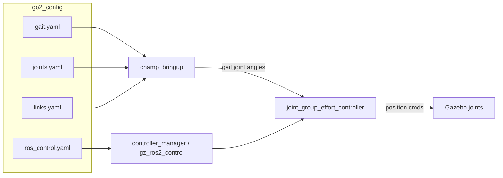

# go2_config

Install-only `ament_cmake` package that holds the CHAMP gait/joints/links maps and the `ros2_control` controller configuration for the Go2 quadruped in simulation.

## Overview

`go2_config` contains no nodes or executables. It is a configuration hub: it installs a `config/` directory of YAML files that other packages load at launch time. The CHAMP quadruped controller (`champ_bringup`) reads the joints, links, and gait maps to generate a walking gait, while the `gz_ros2_control` / `controller_manager` stack reads `ros_control.yaml` to spawn the joint controllers that stream gait angles into Gazebo. The package is pulled in as an `exec_depend` of `go2_bringup`, whose `go2_champ.launch.py` wires every file to its consumer.

## Configuration

All files install to `share/go2_config/config/`.

| File | Consumed by | What it tunes |
|------|-------------|---------------|
| `config/gait/gait.yaml` | `champ_bringup` (`gait_config_path`) | Gait parameters under `gait:` namespace: `knee_orientation` (`">>"`), `pantograph_leg` (`false`), `odom_scaler` (`0.9`), velocity limits `max_linear_velocity_x` (`0.3`), `max_linear_velocity_y` (`0.25`), `max_angular_velocity_z` (`0.4`), `com_x_translation` (`0.0`), `swing_height` (`0.05`), `stance_depth` (`0.01`), `stance_duration` (`0.28`), `nominal_height` (`0.225`). |
| `config/joints/joints.yaml` | `champ_bringup` (`joints_map_path`) | `joints_map`: per-leg ordered joint names (hip, upper_leg, lower_leg, foot) for `left_front`, `right_front`, `left_hind`, `right_hind`. |
| `config/links/links.yaml` | `champ_bringup` (`links_map_path`) | `links_map`: `base` link (`base_link`) plus per-leg ordered link names matching the joints map. |
| `config/ros_control/ros_control.yaml` | `controller_manager` / `gz_ros2_control` | `controller_manager` config (`update_rate: 250` Hz, `use_sim_time: True`) and the two controllers spawned in sim. |
| `config/foxglove.json` | Foxglove Studio | Saved visualization layout (not loaded by ROS). |

### ros_control.yaml controllers

- `joint_states_controller` - `joint_state_broadcaster/JointStateBroadcaster`.
- `joint_group_effort_controller` - `joint_trajectory_controller/JointTrajectoryController` over the 12 leg joints. Despite the name it is configured for a **position** command interface (`command_interfaces: [position]`, `state_interfaces: [position, velocity]`), with `open_loop_control: true` and relaxed constraints (`stopped_velocity_tolerance: 0.0`, `goal_time: 0.0`). The inline comment documents why: under Gazebo Harmonic/DART the effort+PID path oscillates, so a position command is tracked by Gazebo's internal joint controller instead.

### include/ C++ headers

The `include/` directory carries CHAMP-style C++ configuration headers (`quadruped_description.h`, `gait_config.h`, `hardware_config.h`) describing leg geometry, compile-time gait constants, and the actuator/IMU/transport selection (`USE_SIMULATION_ACTUATOR`, `USE_SIMULATION_IMU`, `USE_ROS`). These are reference headers for a firmware-style CHAMP build and are **not installed** by `CMakeLists.txt` (only `config/` is installed); the simulation stack drives the robot from the YAML files above, not these headers.

## Data flow



## Build & run

```bash
cd go2-sim/go2_ws
colcon build --symlink-install --packages-select go2_config
source install/setup.bash
```

This package has no run target. The config files are exercised through `go2_bringup`:

```bash
ros2 launch go2_bringup go2_champ.launch.py headless:=true
```

That launch (`go2_champ.launch.py`) resolves `go2_config`'s share path, passes `joints.yaml`, `links.yaml`, and `gait.yaml` into `champ_bringup`'s `bringup.launch.py`, and spawns `joint_states_controller` and `joint_group_effort_controller` against the `/controller_manager` configured by `ros_control.yaml`.

## Dependencies

From `package.xml`:

- `ament_cmake` (buildtool)
- `launch_ros` (build)

Runtime consumers (not declared here, but required for the configs to do anything): `champ_bringup`, `controller_manager`, `gz_ros2_control`, `joint_state_broadcaster`, `joint_trajectory_controller`.
