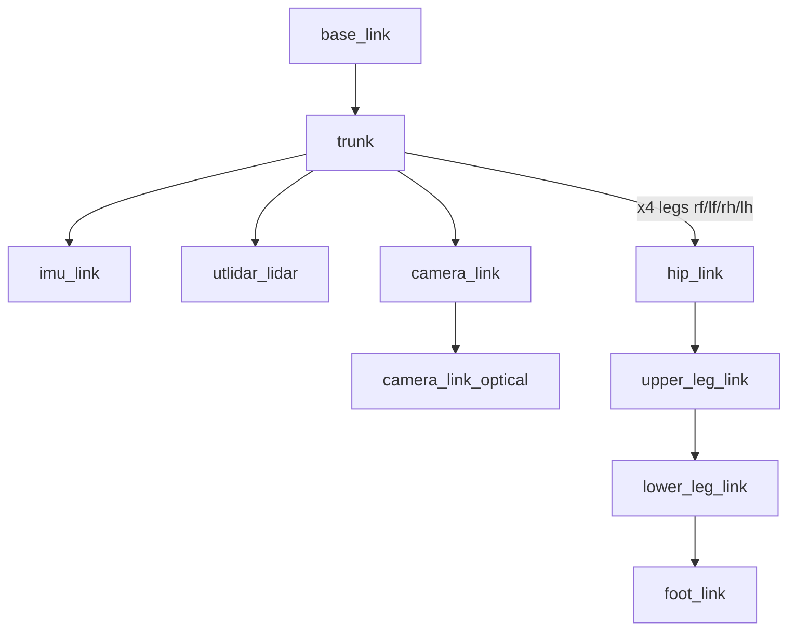

# go2_description

URDF/xacro robot model, meshes, and simulated sensors for the Unitree Go2 quadruped in Gazebo Harmonic.

## Overview

`go2_description` is an `ament_cmake` package that defines the Go2 robot's kinematics (trunk + four 3-DOF legs), visual/collision geometry, inertials, and its simulated sensor suite (L1 LiDAR, RGBD camera, IMU). It ships no runtime nodes; it only installs xacro/URDF, meshes, and config that other packages (notably `go2_bringup`, via `robot_state_publisher` and the Gazebo spawner) consume to build the robot description and bridge sensors. The Harmonic integration uses `gz_ros2_control` plus gz sensors; CHAMP (`champ_base`, from `go2_config`) drives the joint controllers and owns `odom -> base_link`.

## Robot model (xacro)

The entry point is [`xacro/robot_gz.xacro`](xacro/robot_gz.xacro) (robot name `go2`). It includes the supporting macros and assembles the full robot:

| File | Role |
|------|------|
| [`xacro/robot_gz.xacro`](xacro/robot_gz.xacro) | Entry point. Defines `base_link`, `trunk`, sensor links (`imu_link`, `utlidar_lidar`, `camera_link`, `camera_link_optical`), instantiates the four legs, and pulls in the gz integration. |
| [`xacro/const.xacro`](xacro/const.xacro) | Dimensional + kinematic constants (trunk/hip/thigh/calf sizes, link lengths, offsets, masses, inertias, joint limits). |
| [`xacro/materials.xacro`](xacro/materials.xacro) | Named RViz/visual materials. |
| [`xacro/leg.xacro`](xacro/leg.xacro) | `leg` macro: builds one leg's hip/upper-leg/lower-leg/foot links + revolute joints. Param `classic_ros2_control` (default `true`) emits a per-leg Classic Gazebo `ros2_control` block; `robot_gz.xacro` passes `false` to use the combined Harmonic block instead. |
| [`xacro/gazebo_gz.xacro`](xacro/gazebo_gz.xacro) | Gazebo Harmonic integration: `gz_ros2_control` plugin, gz odometry-publisher plugin, the combined 12-joint `ros2_control` system, and the gz sensor definitions. |

### Kinematic structure

`base_link -> trunk` (fixed), with four legs spawned by the `leg` macro for `rf`, `lf`, `rh`, `lh`. Each leg chains:

```
trunk -> <leg>_hip_link -> <leg>_upper_leg_link -> <leg>_lower_leg_link -> <leg>_foot_link
```

Joint names per leg: `<leg>_hip_joint`, `<leg>_upper_leg_joint`, `<leg>_lower_leg_joint` (revolute), `<leg>_foot_joint` (fixed). 12 actuated joints total.



## Simulated sensors

All sensors are defined in [`xacro/gazebo_gz.xacro`](xacro/gazebo_gz.xacro) as gz sensors. They publish on gz topics that the `ros_gz` bridge (configured in `go2_bringup`) maps to the ROS contract noted below.

| Sensor | gz type | Link / `gz_frame_id` | gz topic | Rate | Key settings |
|--------|---------|----------------------|----------|------|--------------|
| L1 LiDAR | `gpu_lidar` | `utlidar_lidar` | `utlidar` (→ `/utlidar/points`, bridged to `/utlidar/cloud_deskewed`) | 20 Hz | 450 horizontal samples over ±π; 32 vertical rings over ±0.785 rad (≈90° vertical); range 0.15–30 m. Mounted at the chin, tilted ≈8.5° down. |
| RGBD camera | `rgbd_camera` | `camera_link`, optical `camera_link_optical` | `camera` (→ `camera/image`, `camera/depth_image`, `camera/camera_info`, `camera/points`) | 30 Hz | 640×480 R8G8B8, horizontal FOV 1.396 rad; RGB clip 0.1–30 m, depth clip 0.3–8 m. Image/depth/CameraInfo published in the z-forward optical frame. |
| IMU | `imu` | `imu_link` | `imu` (→ `/imu`) | 200 Hz | `always_on`. |

The camera optical frame `camera_link_optical` uses the standard ROS optical convention (z-forward, x-right, y-down) so LiDAR→image projection and depth back-projection use the usual `image_geometry` convention.

## Control / odometry (Harmonic)

`gazebo_gz.xacro` also wires up actuation and base odometry:

- **`gz_ros2_control` plugin** — loads `controller_manager` and the controllers from `$(find go2_config)/config/ros_control/ros_control.yaml` (the active file; see Configuration). The `ros2_control` system declares all 12 leg joints with a `position` command interface and `position`/`velocity`/`effort` state interfaces, seeded to the stand pose (hip 0, upper-leg 0.9, lower-leg −1.8 rad).
- **`gz-sim-odometry-publisher-system`** — publishes ground-truth base odometry: `odom_gz` (→ ROS `/odom`) and the `odom_tf` transform (→ `/tf`), `odom` → `base_link`, 50 Hz. This is the sim's single localization source (no EKF). CHAMP also drives the joint controllers and provides leg odometry.

## Configuration

| File | What it tunes |
|------|---------------|
| [`config/ros_control/ros_control.yaml`](config/ros_control/ros_control.yaml) | Harmonic `controller_manager` (250 Hz) with `joint_state_broadcaster` + `joint_trajectory_controller` (`joint_group_effort_controller`) over the 12 leg joints, including per-joint PID gains. Note: the running stack loads the copy under `go2_config` (referenced by `gazebo_gz.xacro`); this in-package copy is the description-side reference. |
| [`config/_robot_control.yaml`](config/_robot_control.yaml) | Legacy Gazebo-Classic `unitree_legged_control` per-joint position controllers + PID gains (FL/FR/RL/RR naming). Kept for the Classic path; not used by the Harmonic build. |
| [`config/_joint_names_go2_description.yaml`](config/_joint_names_go2_description.yaml) | `controller_joint_names` list (legacy/Classic joint-name mapping). |

## Assets

- `meshes/` — collada (`.dae`) visual meshes (trunk, hip, thigh/thigh_mirror, calf/calf_mirror, foot, hokuyo).
- `dae/` — additional/source collada meshes.
- `urdf/` — collision-model reference images.

## Build & run

```bash
# Build just this package
cd go2-sim/go2_ws
colcon build --symlink-install --packages-select go2_description
source install/setup.bash
```

This package has no executables. To inspect or visualize the model, expand the xacro and publish it (typically done by `go2_bringup` launch files):

```bash
# Expand the xacro to a URDF for inspection
xacro $(ros2 pkg prefix go2_description)/share/go2_description/xacro/robot_gz.xacro > /tmp/go2.urdf

# Publish the description (example; bringup normally does this with the Gazebo spawn + sensors)
ros2 run robot_state_publisher robot_state_publisher /tmp/go2.urdf
```

## Dependencies

From [`package.xml`](package.xml):

- Build tool: `ament_cmake`
- Build/exec: `launch_ros`
- Exec: `robot_state_publisher`, `joint_state_publisher`, `urdf`, `xacro`, `rviz2`, `gazebo_plugins`

The Harmonic sensor/control integration additionally relies (at runtime, via other packages) on `gz_ros2_control`, the `ros_gz` bridge, and `go2_config`'s `ros_control.yaml`.
