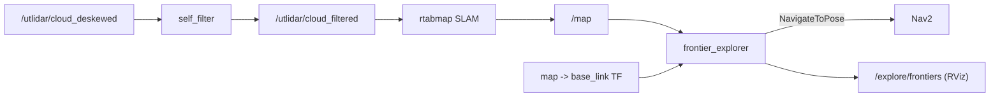

# go2_exploration

Autonomous frontier-based mapping and LiDAR self-filtering for the Go2 inspection stack.

## Overview

`go2_exploration` is an `ament_cmake` C++ package providing two standalone nodes used during the
mapping phase of the Go2 stack. `frontier_explorer` drives the robot to unexplored areas via the Nav2
`NavigateToPose` action, selecting goals by information gain rather than pure nearest-frontier, with a
blacklist/recovery state machine to avoid getting stuck. `self_filter` geometrically removes the
robot's own body from the 360-degree L1 LiDAR cloud so the navigation costmap is not polluted by
self-hits. Both nodes depend only on standard ROS topics, TF, and the Nav2 action, so they port
unchanged between simulation and the real Go2.



## Nodes

### frontier_explorer

Reads the SLAM occupancy grid (`/map`), detects frontiers (free cells adjacent to unknown),
BFS-clusters them, scores each cluster by information gain (large unknown reveal penalised by
distance), and navigates to the best one through Nav2. Recovery is owned by Nav2: the node never
publishes `/cmd_vel`. It blacklists goals that are reached, rejected, time out, or stall, with TTL
expiry so no region is abandoned permanently. FSM: `IDLE -> EXPLORING -> NAVIGATING -> (EXPLORING | DONE)`.

Key parameters (defaults in parentheses):

| Parameter | Meaning |
|---|---|
| `min_frontier_size` (8) | Minimum BFS cluster size (cells) to consider a frontier |
| `min_goal_distance` (0.8) | Minimum robot-to-goal distance; keeps goals beyond Nav2 goal tolerance |
| `max_goal_distance` (3.0) | Cap on a single goal; far frontiers are stepped toward via a nearer waypoint |
| `free_threshold` (25) | Max occupancy value treated as free |
| `occupied_threshold` (65) | Min occupancy value treated as a wall |
| `goal_clearance` (0.6) | Required clearance from walls around a goal cell (~ costmap inflation) |
| `blacklist_radius` (0.5) | Radius around a blacklisted point that blocks new goals |
| `blacklist_ttl` (30.0) | Seconds before a blacklist entry expires |
| `goal_timeout` (60.0) | Hard cap (s) on a single navigation goal |
| `planning_period` (2.0) | Tick / replanning period (s) |
| `arrival_radius` (0.55) | Distance considered "close enough" to a frontier |
| `arrival_patience` (3.0) | Seconds lingering near a goal before advancing |
| `progress_dist` (0.25) | Motion (m) counted as progress |
| `progress_timeout` (18.0) | Seconds without progress before giving up (blacklist + replan) |
| `gain_scale` (1.0) | Weight on frontier size in the score |
| `potential_scale` (3.0) | Distance penalty weight in the score |
| `openness_radius` (0.6) | Window (m) for the openness metric |
| `openness_scale` (0.0) | Weight on openness; 0 disables (no-op) |
| `min_openness` (0.0) | Reject goals below this openness; 0 accepts all |
| `openness_band` (0.0) | If >0, within `best_d + band` pick the most-open cell |
| `done_confirm` (3) | Consecutive empty cycles required before declaring DONE |
| `max_clear_retries` (3) | Blacklist clears allowed between mapping-progress successes |
| `autostart` (true) | Start in EXPLORING instead of IDLE |
| `robot_base_frame` ("base_link") | Robot frame for the `map -> base` TF lookup |

Interfaces:

- Subscribes: `/map` (`nav_msgs/OccupancyGrid`, transient-local reliable QoS); TF `map -> <robot_base_frame>`.
- Publishes: `/explore/frontiers` (`visualization_msgs/MarkerArray`, frontier markers for RViz).
- Action client: `navigate_to_pose` (`nav2_msgs/action/NavigateToPose`).
- Services: `/explore/start` and `/explore/stop` (`std_srvs/srv/Empty`).

Run:

```bash
ros2 run go2_exploration frontier_explorer --ros-args \
  -p use_sim_time:=true -p autostart:=true -p robot_base_frame:=base_link
```

### self_filter

Drops LiDAR points that fall inside a robot-body box defined in the robot base frame, removing
trunk/leg/foot self-returns from the 360-degree cloud. Each incoming cloud is transformed into the
base frame; points inside the box are dropped and the rest are republished in the original frame. If
the required TF is not yet available the cloud is passed through unchanged rather than dropped.

Key parameters (defaults in parentheses):

| Parameter | Meaning |
|---|---|
| `base_frame` ("base_link") | Frame in which the body box is defined |
| `box_x_min` (-0.40) / `box_x_max` (0.40) | Body box X extent (m) |
| `box_y_min` (-0.26) / `box_y_max` (0.26) | Body box Y extent (m) |
| `box_z_min` (-0.50) / `box_z_max` (0.40) | Body box Z extent (m), feet to top of trunk |
| `input_topic` ("/utlidar/cloud_deskewed") | Incoming point cloud |
| `output_topic` ("/utlidar/cloud_filtered") | Filtered point cloud |

Interfaces:

- Subscribes: `input_topic` (`sensor_msgs/PointCloud2`, sensor-data QoS); TF `base_frame -> cloud frame_id`.
- Publishes: `output_topic` (`sensor_msgs/PointCloud2`, keep-last 5).

Run:

```bash
ros2 run go2_exploration self_filter --ros-args -p use_sim_time:=true
```

## Build & run

```bash
cd go2-sim/go2_ws
colcon build --symlink-install --packages-select go2_exploration
source install/setup.bash

# then run either node (see per-node Run commands above)
ros2 run go2_exploration frontier_explorer --ros-args -p use_sim_time:=true
ros2 run go2_exploration self_filter --ros-args -p use_sim_time:=true
```

> Launch wiring (sim mapping, sourcing `/map`, TF and Nav2) lives in the `go2_bringup` package; this
> package ships the two executables only.

## Dependencies

ROS dependencies declared in `package.xml`:

- Build: `ament_cmake`
- `rclcpp`, `rclcpp_action`
- `nav_msgs`, `geometry_msgs`, `sensor_msgs`, `visualization_msgs`, `nav2_msgs`, `std_srvs`
- `tf2`, `tf2_ros`
