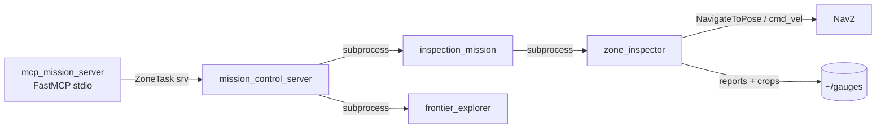

# go2_inspection

Mission brain of the Go2 inspection stack: drives the robot zone-by-zone, runs open-vocabulary YOLOE detection during a 360-degree spin, localizes and de-duplicates detections, writes per-zone + facility reports, and exposes the whole pipeline as a ROS 2 service layer and an MCP tool set.

## Overview

`go2_inspection` is an `ament_python` package that sits on top of the running base stack (Gazebo + CHAMP + RTAB-Map SLAM / localization + Nav2). It does **not** modify SLAM or Nav2; it only consumes their topics/actions. For each segmented zone it samples a few safe interior viewpoints, drives there with Nav2, spins 360 degrees in place while a YOLOE open-vocabulary detector runs continuously, projects every detection into the `map` frame via the depth camera, de-duplicates by class + world position, crops each unique object, and emits reports and annotated maps. A thin ROS 2 service layer (`ZoneTask`) wraps these capabilities as single-call triggers, and a FastMCP stdio server wraps each service as a natural-language tool for Claude.



## Nodes

### `zone_inspector` (entry point)
Inspects **one** zone: load polygon -> sample interior viewpoints (eroded by a safety margin) -> Nav2 to each viewpoint -> slow in-place 360-degree spin (direct `/cmd_vel`) with live YOLOE detection -> depth->map projection -> position validation -> dedup -> crops -> reports. Run-once contract: exits 0 on `DONE`, 1 on abort. Degrades gracefully when YOLOE weights / CLIP backend are missing (still navigates + spins, writes an `available:false` result).

- Subscribes: `/camera/camera_info` (`CameraInfo`), `/camera/image_raw` (`Image`), `/camera/depth/image_raw` (`Image`, 32FC1, sensor-data QoS), TF (`map`, `base_link`, `camera_link_optical`).
- Publishes: `/cmd_vel` (`Twist`) for the spin.
- Action client: `navigate_to_pose` (`nav2_msgs/NavigateToPose`).

Key parameters (defaults in parentheses):

| Parameter | Meaning |
|---|---|
| `zone_id` (`zone_0`) | which zone to inspect |
| `zones_file` (`""`) | path to the zones YAML (required) |
| `out_dir` (`~/gauges`) | output root |
| `map_yaml` (`report_utils.DEFAULT_MAP_YAML`) | saved occupancy map for plotting + position checks |
| `safety_margin` (`0.5`) | polygon erosion in m for viewpoint sampling |
| `vp_spacing` (`3.0`) | viewpoint grid spacing in m |
| `max_viewpoints` (`4`) | cap on viewpoints per zone |
| `grid_res` (`0.1`) | polygon raster resolution |
| `spin_speed` (`0.4`) | in-place yaw rate (rad/s) |
| `spin_overlap_deg` (`20.0`) | extra spin past 360 deg |
| `nav_timeout` (`120.0`) / `build_timeout` (`20.0`) | per-goal / build-phase timeouts (s) |
| `max_nav_retries` (`2`) / `nav_settle` (`1.0`) | transient-abort retries / cooldown before a goal |
| `det_conf` (`0.40`) | confidence floor |
| `det_iou` / `det_imgsz` / `det_max_det` | NMS IoU / inference size / max detections (from `detect_utils.TUNED`) |
| `det_weights` (`detect_utils.DEFAULT_WEIGHTS`) | YOLOE weights path (`YOLOE_WEIGHTS` env or `~/weights/yoloe-11s-seg.pt`) |
| `det_device` (`YOLOE_DEVICE` env or `""`) | torch device |
| `center_only` (`False`) | restrict to forward bearings |
| `max_depth` (`6.0`) / `min_valid_frac` (`0.30`) | depth projection limits |
| `dedup_radius` (`0.6`) | world-distance dedup radius (m) |
| `capture_pad` (`0.10`) | crop padding fraction |
| `optical_frame` (`camera_link_optical`) | depth deprojection frame |
| `spin_settle` (`0.4`) | skip post-nav blur before capturing |
| `validate_map` (`True`) / `obstacle_check_radius` (`1.2`) | reject detections floating in mapped free space |
| `zone_margin` (`1.0`) | metres outside the polygon still accepted |
| `min_observations` (`2`) | drop phantoms seen in fewer frames (auto-relaxed to 1 on CPU) |

### `inspection_mission` (entry point)
Map-driven mission with no hard-coded poses. From HOME, for each candidate zone in `zones.yaml`: Nav2 to the zone `nav_point` (falls back to center) -> run `zone_inspector` as a child process -> optionally return HOME -> aggregate one facility manifest + map + report. Additive flags let the service layer compose navigate-only / single-zone / dock-only behaviors.

- Action client: `navigate_to_pose`.
- Parameters: `zones_file` (`~/.go2_maps/facility_inspection_zones.yaml`), `map_yaml` (`report_utils.DEFAULT_MAP_YAML`), `min_area` (`15.0`, skip tiny zones), `zones` (`""`, comma list to restrict), `inspect` (`True`; `False` = navigate only), `return_home` (`True`), `goto_home` (`False`; `True` = just dock at HOME). Forces `use_sim_time:=true`.

### `mission_control_server` (entry point)
Thin ROS 2 **service** layer over the stack. Heavy capabilities run the existing validated nodes as isolated-session subprocesses, so the server never fights rclpy threading and never modifies the working nodes. It holds the frontier child handle, a one-motion-at-a-time robot lock, a cached `/map`, and the last/current task. Motions are async: a service returns a `task_id` immediately and a monitor thread frees the lock on finish; poll `get_status`.

- Subscribes: `/map` (`OccupancyGrid`, transient-local) for coverage/status.
- Publishes: `/cmd_vel` (`Twist`) zero-velocity safety stop on cancel.
- Parameters: `zones_file` (`~/.go2_maps/facility_inspection_zones.yaml`), `workspace` (`GO2_WS` env or auto-detected), `map_name` (`facility_inspection`).

Services (all `go2_inspection_interfaces/srv/ZoneTask`):

| Group | Service | Purpose |
|---|---|---|
| Mapping | `start_exploration` | launch `frontier_explorer` (autostart) |
| | `stop_exploration` | stop the frontier child, free the lock |
| | `save_map` | grab grid -> segment zones -> write npz/pgm/yaml + copy rtabmap.db |
| Navigation | `navigate_to_zone` | drive to a zone (no inspection), async |
| | `navigate_home` | dock at map origin, async |
| Inspection | `inspect_zone` | drive + viewpoint/spin inspect one zone, async |
| | `run_mission` | full mission over all/subset of zones, async |
| Control | `cancel_task` | abort running motion and/or exploration, stop robot |
| Data | `list_zones` | zone id / center / area |
| | `get_zone_image` | paths to `zone_map.png`, contact sheet, crops |
| | `get_zone_gauges` | detected objects (trimmed `objects.json`) |
| | `get_report` | facility manifest summary |
| | `get_status` | frontier/busy/task state + map coverage % |

## MCP server (`mcp_mission_server`)

A FastMCP **stdio** server that bridges the `mission_control_server` services to Claude as natural-language tools. It is **not** a `console_scripts` entry point: run it via `run_mcp_sim.sh` (sources ROS + the sim workspace + DDS env + the venv with `fastmcp`) and register it with Claude:

```bash
claude mcp add go2-sim -- /home/adyansh/go2-inspection/go2-sim/run_mcp_sim.sh
```

It lazily starts a single rclpy client node, normalizes NL zone references (`zone 3`/`room 3`/`3` -> `zone_3`; `all`/`everything` -> all zones), and returns a clear "service not available" message if `mission_control` is not up.

MCP tools: `start_exploration`, `stop_exploration`, `save_map`, `navigate_to_zone`, `navigate_home`, `inspect_zone`, `run_mission`, `cancel_task`, `list_zones`, `get_zone_objects`, `get_zone_gauges`, `get_report`, `get_status`, `get_zone_image`.

Notes: `get_zone_objects` is the preferred data tool; `get_zone_gauges` is a deprecated alias (the robot detects generic objects, not gauges). `get_zone_image` returns the annotated map, contact sheet, and object crops inline so the model can see them. Both map to the server's `get_zone_gauges` / `get_zone_image` services.

## Modules (not nodes)

- `detect_utils.py` — YOLOE open-vocab helpers: `load_model` (`set_classes(names, get_text_pe(names))`), `infer`, `contact_sheet`. Holds the tuner-exported `PROMPTS` (class-id order is load-bearing — do not re-spell), `TUNED` predict params (`iou=0.59`, `imgsz=1280`, `max_det=21`, `agnostic_nms=False`), and `DEFAULT_WEIGHTS`. Requires `ultralytics` + a CLIP text backend; absent backend raises a clear error and the caller degrades.
- `report_utils.py` — world<->pixel mapping on the saved `.pgm`, `load_occupancy`, `plot_zone_map` / `plot_facility_map`, and `write_zone_report` (`report.md` / `report.csv`); exports `DEFAULT_MAP_YAML`.
- `yoloe_tuner.py` — offline prompt/param tuning helper that exports `PROMPTS` and `TUNED`.

## Interfaces

Defined in the sibling package `go2_inspection_interfaces`:

```
# srv/ZoneTask.srv
string zone_id        # target zone id; '' or 'all' = every candidate zone (where supported)
---
bool success
string message
string result_json    # structured payload (objects, paths, report, status) as JSON
```

## Outputs (`~/gauges/<zone>/`)

`crops/<id>.png`, `objects.json` (deduped uniques: `id, class, confidence, world[x,y,z], crop, viewpoint, n_observations, localized`), `detections.json` (every observation + accept/reject reason), `objects_contact_sheet.png`, `zone_map.png`, `report.md`, `report.csv`. Facility rollup in `~/gauges/`: `facility_inspection_manifest.json`, `facility_map.png`, `facility_report.md`.

## Build & run

```bash
# build
cd go2-sim/go2_ws && colcon build --symlink-install --packages-select \
    go2_inspection go2_inspection_interfaces
source install/setup.bash

export YOLOE_WEIGHTS=~/weights/yoloe-11s-seg.pt   # YOLOE weights (not auto-downloaded)

# inspect ONE zone (base stack: localization + map_server + Nav2 must already be up)
ros2 run go2_inspection zone_inspector --ros-args -p use_sim_time:=true \
    -p zone_id:=zone_1 -p zones_file:=~/.go2_maps/facility_inspection_zones.yaml

# full mission over all candidate zones
ros2 run go2_inspection inspection_mission --ros-args -p use_sim_time:=true

# the service layer (run beside the base stack)
ros2 run go2_inspection mission_control_server
```

Launch wrappers for the base stack and the service layer live in `go2_bringup` (e.g. `inspection_nav.launch.py`, `mission.launch.py`, `mission_control.launch.py`); this package ships no launch files of its own.

## Dependencies

- ROS 2 (Jazzy): `rclpy`, `nav2_msgs`, `nav_msgs`, `geometry_msgs`, `sensor_msgs`, `std_msgs`, `std_srvs`, `action_msgs`, `tf2_ros`, `tf2_geometry_msgs`, plus the in-repo `go2_inspection_interfaces` and `go2_zones`.
- Python: `numpy`, `opencv` (`cv2`), `pyyaml`, `scipy`.
- pip-only (not in rosdep): `ultralytics` (YOLOE) + the ultralytics CLIP text backend, and `fastmcp` (MCP server). Optional `torch` (CUDA) for GPU inference.
