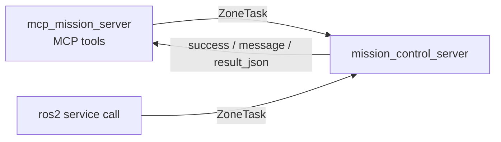

# go2_inspection_interfaces

ROS 2 interface package defining `ZoneTask.srv`, the single uniform service contract used by every Go2 inspection mission-control service.

## Overview

This is an `ament_cmake` + `rosidl` interface-only package. It contributes no nodes or launch files; it generates the `go2_inspection_interfaces/srv/ZoneTask` service type. Every mission-control service in the stack uses this one request/response shape, so the MCP/tool layer can wrap all of them with a single client pattern. It sits at the boundary between the mission orchestration node (`mission_control_server`) and its callers (`mcp_mission_server`, CLI, and `ros2 service call`).

## Interfaces

### `srv/ZoneTask.srv`

```
# Request
string zone_id        # target zone id; '' or 'all' = every candidate zone (where supported)
---
# Response
bool success
string message        # human-readable status
string result_json    # structured payload (objects, paths, report, status) as a JSON string
```

- `zone_id` is ignored by services that do not need it (e.g. `start_exploration`, `get_status`).
- `result_json` carries the structured data as a JSON string; `message` is the human-readable summary.

## Who uses it

The interface is consumed by `go2_inspection`:

- **`mission_control_server`** (node `mission_control`) creates 13 services, all typed `ZoneTask`:
  `start_exploration`, `stop_exploration`, `save_map`, `navigate_to_zone`, `navigate_home`,
  `inspect_zone`, `run_mission`, `cancel_task`, `list_zones`, `get_zone_image`, `get_zone_gauges`,
  `get_report`, `get_status`.
- **`mcp_mission_server`** wraps these services as MCP tools using one shared `ZoneTask` client pattern.
- **`go2_bringup`** declares the dependency and launches the server via `mission_control.launch.py`.



## Build & run

This package only generates a type; there is nothing to run directly.

```bash
# from go2-sim/go2_ws
colcon build --symlink-install --packages-select go2_inspection_interfaces
source install/setup.bash

# inspect the generated service
ros2 interface show go2_inspection_interfaces/srv/ZoneTask

# example call once mission_control is running
ros2 service call /list_zones go2_inspection_interfaces/srv/ZoneTask "{zone_id: ''}"
```

## Dependencies

From `package.xml`:

- `ament_cmake` (build tool)
- `rosidl_default_generators` (build), `rosidl_default_runtime` (exec)
- Member of the `rosidl_interface_packages` group
- License: Apache-2.0
