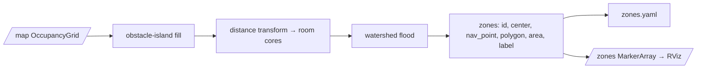

# go2_zones

Automatic topological zone (room) segmentation of a saved occupancy grid for the Go2 autonomous inspection sweep.

## Overview

`go2_zones` turns an occupancy grid (the RTAB-Map `/map`, or a saved map) into a set of labelled
zones — coherent rooms / open regions — that the inspection mission visits one at a time. The
segmenter cleans free-standing clutter out of the free space (obstacle-island fill), grows distance-transform
seeds into room cores, and floods them with a watershed so each region gets a single label. Each emitted
zone carries a centre, boundary polygon, area, and a `nav_point` (a guaranteed-open navigation goal), which
the `go2_inspection` mission consumes to drive the per-zone scan. It sits downstream of SLAM (consuming the
saved/published map) and upstream of mission orchestration.

## Nodes

### `zone_segmenter`

Subscribes to a latched `/map`, segments it into zones, writes a `zones.yaml` file, and publishes RViz
markers for the zone polygons and labels. It can also run offline against a saved `.npz` map.

**Parameters**

| Parameter        | Default              | Meaning                                                                     |
| ---------------- | -------------------- | --------------------------------------------------------------------------- |
| `use_sim_time`   | `true`               | Use the simulation clock.                                                    |
| `core_dist_m`    | `1.6`                | Distance-transform threshold (m) that defines room cores; corridors/doorways fall below it. |
| `min_area_m2`    | `6.0`                | Minimum zone area (m²); smaller watershed regions are dropped.               |
| `island_max_m2`  | `2.5`                | Free-standing occupied blobs smaller than this are reclassified as free (obstacle-island fill). |
| `out_path`       | `~/zones.yaml`       | File path the segmented zones are written to.                                |

> Note: `wall_span_m` (3.0 m, the span above which an occupied blob is kept as a wall run) is fixed in
> `segment_grid` and is not exposed as a ROS parameter.

**Topics**

| Direction  | Topic    | Type                                  | Notes                                                            |
| ---------- | -------- | ------------------------------------- | ---------------------------------------------------------------- |
| Subscribe  | `/map`   | `nav_msgs/OccupancyGrid`              | QoS: RELIABLE, TRANSIENT_LOCAL, KEEP_LAST depth 1 (latched map). |
| Publish    | `/zones` | `visualization_msgs/MarkerArray`      | LINE_STRIP zone polygons + TEXT_VIEW_FACING labels, in `map` frame. |

**Output file (`out_path`)**

JSON-formatted `zones.yaml` with a top-level `zones` list. Each zone has:

- `id` — e.g. `zone_0` (sorted largest-area first)
- `center` — `[x, y]` centroid in map coordinates
- `nav_point` — `[x, y]` deepest originally-free point in the zone (a safe nav goal off walls and props)
- `polygon` — list of `[x, y]` boundary points in map coordinates
- `area` — zone area in m²
- `label` — generic quadrant tag (e.g. `NW`, `center`) for reports/markers only

## Standalone (offline) use

The same module runs without ROS against a saved NumPy map archive for development/testing:

```bash
python3 go2_zones/zone_segmenter.py <facility_map.npz>
```

The `.npz` must contain `grid` (int16 H×W, `-1` unknown / `0` free / `100` occupied), `res`, `origin_x`,
and `origin_y`. It writes `zones.yaml` and a `zones_viz.png` visualization next to the input file. An
example output pair lives in [`maps/`](maps/) (`facility_gauges_zones.yaml`, `facility_gauges_zones_viz.png`).

## Pipeline



## Build & run

```bash
# Build
cd go2-sim/go2_ws && colcon build --symlink-install --packages-select go2_zones

# Source
source /opt/ros/jazzy/setup.bash
source go2-sim/go2_ws/install/setup.bash

# Run the node (subscribes /map, writes ~/zones.yaml, publishes /zones)
ros2 run go2_zones zone_segmenter

# With custom parameters
ros2 run go2_zones zone_segmenter --ros-args \
  -p core_dist_m:=1.6 -p min_area_m2:=6.0 -p island_max_m2:=2.5 \
  -p out_path:=$HOME/.go2_maps/maze_zones.yaml
```

## Dependencies

ROS: `rclpy`, `nav_msgs`, `visualization_msgs`, `geometry_msgs`.
Third-party: `python3-numpy`, `python3-opencv`.

Build type: `ament_python`.
